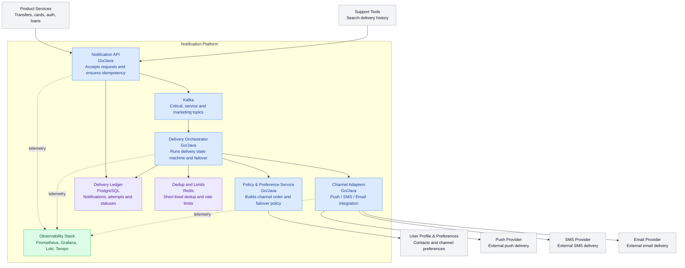
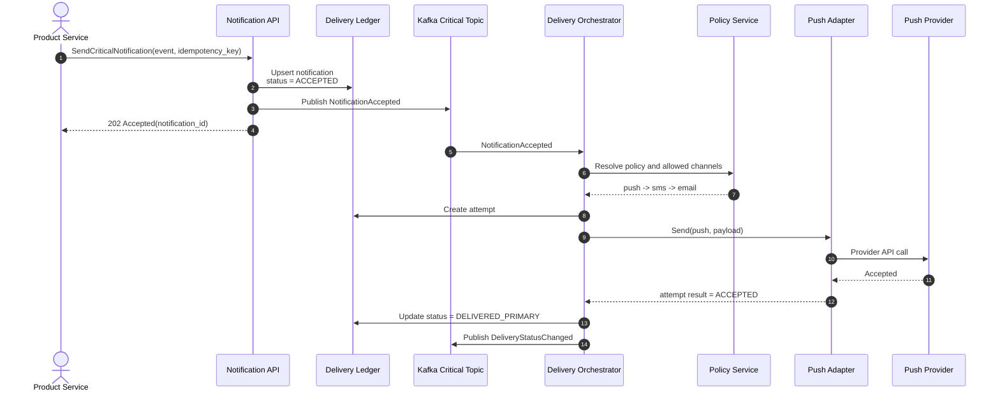
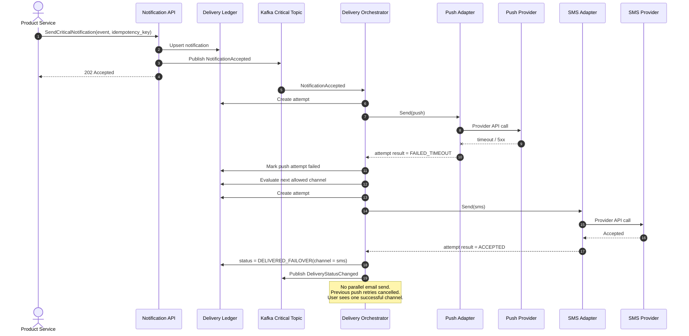
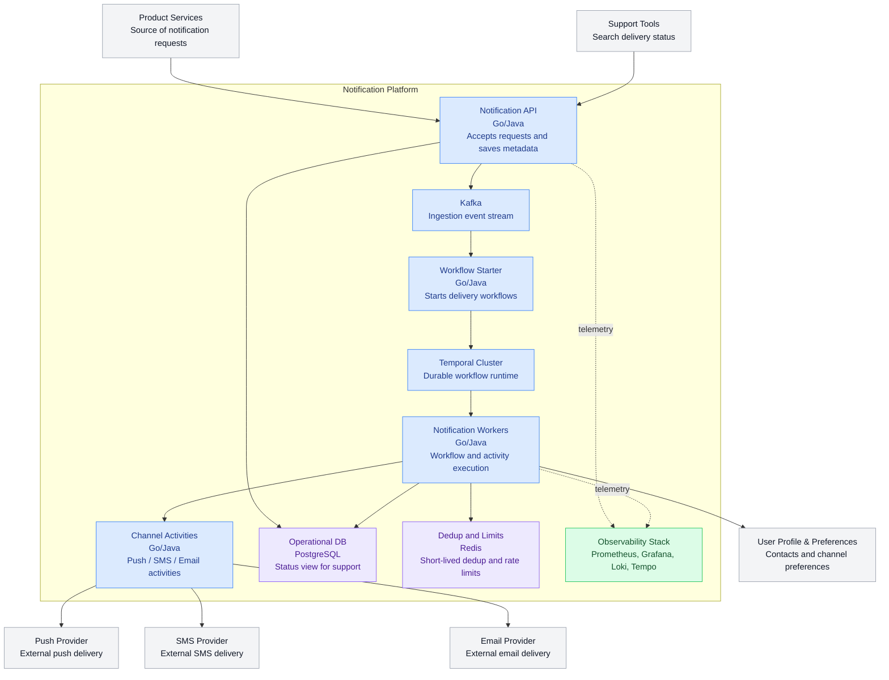
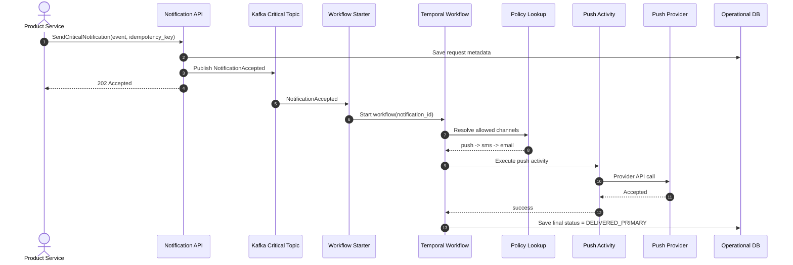
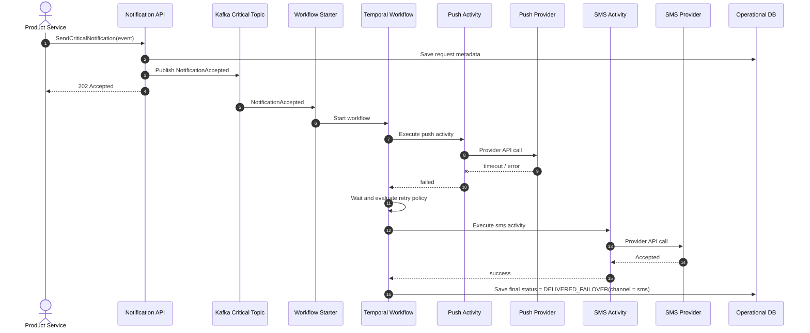

# RFC: Проектирование механизма гарантированной доставки критичных уведомлений с кросс-канальным failover

| Метаданные | Значение                   |
|------------|----------------------------|
| **Статус** | DESIGN                     |
| **Автор(ы)** | Arsentii Sergienko         |
| **Ответственный** | Notification Platform Team |
| **Бизнес-заказчик** | Head of Digital Banking    |
| **Ревьюеры** |                            |
| **Дата создания** | 07.04.2026                 |
| **Дата обновления** |                            |

---

## Оглавление

1. [Контекст](#контекст)
2. [Продуктовый анализ](#продуктовый-анализ)
3. [Пользовательские сценарии](#пользовательские-сценарии)
4. [Статистика](#статистика)
5. [Требования](#требования)
6. [Варианты решения](#варианты-решения)
7. [Сравнительный анализ](#сравнительный-анализ)
8. [Выводы](#выводы)
9. [Связанные задачи](#связанные-задачи)
10. [Приложения](#приложения)

---

## Контекст

> **Цель раздела:** Описать проблему или возможность, которую решает данное предложение.

Сейчас команды онлайн-банка отправляют уведомления независимо друг от друга через разные сервисы и провайдеров. Это приводит к задержкам, дублям, отсутствию единого контроля и невозможности гарантировать доставку критичных сообщений. Для бизнеса это означает рост жалоб, ухудшение пользовательского опыта и прямой риск для безопасности операций.

Предлагается централизованная Notification Platform. Этот RFC фокусируется на самой рискованной подсистеме платформы: гарантированной доставке критичных транзакционных уведомлений с автоматическим failover между push, SMS и email.

Критичными считаются уведомления, связанные с подтверждением перевода, списанием средств, блокировкой карты, входом в аккаунт и другими событиями, где недоставка или чрезмерная задержка напрямую влияет на доверие пользователя и безопасность.

### Ключевые вопросы
- **Какую проблему мы решаем?** Создаём единый механизм, который гарантирует, что критичное уведомление будет доставлено хотя бы по одному разрешённому каналу без пользовательских дублей.
- **Почему это важно сейчас?** Текущая фрагментация уже мешает достижению бизнес-целей: retention `+15%`, снижение жалоб `-30%`, гарантированная доставка критичных уведомлений.
- **Кто затронут этим изменением?** Пользователи банка, продуктовые команды, служба поддержки, security и владельцы внешних каналов доставки.

---

## Продуктовый анализ

### Бизнес-цели

| Цель | Как измеряем |
|------|--------------|
| Повысить retention | Рост retention на 15% после внедрения централизованной платформы |
| Снизить количество жалоб | Снижение жалоб на уведомления на 30% |
| Защитить критичные пользовательские сценарии | Доставка критичных уведомлений хотя бы по одному каналу в рамках SLA |
| Снизить стоимость доставки | Минимизация использования SMS при доступном push |
| Упростить поддержку | Единая история статусов, трассировка и аудит доставки |

### Заинтересованные стороны

| Роль                | Интерес |
|---------------------|---------|
| Пользователь банка  | Получать важные уведомления быстро, без дублей и пропусков |
| Продуктовые команды | Интегрироваться с единой платформой по понятному API |
| Служба поддержки    | Видеть статус доставки и причину отказа |
| SRE                 | Иметь предсказуемую, наблюдаемую и масштабируемую систему |
| Отдел безопасников  | Получать аудит, контроль доступа и защиту персональных данных |
| Финансы             | Контролировать стоимость дорогих каналов, прежде всего SMS |

### Принятые бизнес-допущения

- Критичные транзакционные уведомления пользователь не может отключить полностью.
- Пользователь может задать предпочтительный канал, но платформа может нарушить его приоритет ради доставки критичного уведомления.
- Маркетинговые уведомления могут быть полностью отключены пользователем.
- Сервисные уведомления могут быть частично отключены по категориям.
- По умолчанию приоритет каналов для критичных событий: `push -> email -> SMS`, если у пользователя есть валидный push-token.

### Что входит и что не входит в RFC

**Входит:**
- Механизм приёма, маршрутизации, доставки и failover для критичных уведомлений.
- Учёт пользовательских предпочтений и ограничений.
- Дедупликация, идемпотентность, аудит и наблюдаемость.
- Сравнение двух архитектурных вариантов.

**Не входит:**
- Дизайн шаблонов сообщений.
- AB-тесты маркетинговых кампаний.
- Тонкая сегментация маркетинга.
- Выбор конкретного коммерческого SMS/email-провайдера.

---

## Пользовательские сценарии

> **Цель раздела:** Описать как пользователи будут взаимодействовать с системой.

| Приоритет | Тип сценария | Действующее лицо | Сценарий                                                                                                                                       |
|-----------|--------------|------------------|------------------------------------------------------------------------------------------------------------------------------------------------|
| MUST HAVE | User Story | Клиент банка | После перевода средств клиент получает подтверждение почти мгновенно; если push недоступен, уведомление автоматически уходит в резервный канал |
| MUST HAVE | User Story | Клиент банка | При списании средств клиент получает только одно итоговое уведомление, даже если система делала повторы и failover                             |
| MUST HAVE | Operational | Оператор поддержки | Оператор видит по `notification_id` историю попыток доставки, выбранный канал и причину отказа                                                 |
| MUST HAVE | Integration | Продуктовая команда | Сервис переводов отправляет одно событие в платформу и не интегрируется отдельно с push/SMS/email                                              |
| SHOULD HAVE | User Story | Клиент банка | Пользователь задаёт предпочтительный канал и получает сервисные/маркетинговые уведомления в соответствии с настройками                         |
| SHOULD HAVE | Operational | SRE | При деградации SMS-провайдера команда видит рост failover, ошибки, задержки и влияние на SLA                                                   |
| COULD HAVE | Business | Менеджер продукта | Менеджер меняет приоритеты каналов по сегментам пользователей без изменений в продуктовых сервисах                                             |

**Приоритеты:**
- **MUST HAVE** — обязательно к реализации
- **SHOULD HAVE** — желательно реализовать
- **COULD HAVE** — опционально, при наличии ресурсов

---

## Статистика

### Входные данные из задания

| Показатель | Значение |
|------------|----------|
| MAU | 10 млн |
| DAU | 3 млн |
| Peak Concurrent Users | 300 000 |
| Транзакционные уведомления | 2 на пользователя в день |
| Сервисные уведомления | 3 на пользователя в день |
| Маркетинговые уведомления | 5 на пользователя в день |

### Базовый расчёт нагрузки

| Метрика | Формула | Результат |
|---------|---------|-----------|
| Транзакционные уведомления в день | `3 000 000 * 2` | `6 000 000/день` |
| Сервисные уведомления в день | `3 000 000 * 3` | `9 000 000/день` |
| Маркетинговые уведомления в день | `3 000 000 * 5` | `15 000 000/день` |
| Всего уведомлений в день | `6M + 9M + 15M` | `30 000 000/день` |
| Средний общий RPS | `30 000 000 / 86 400` | `~347 msg/s` |
| Средний RPS для критичных | `6 000 000 / 86 400` | `~69 msg/s` |

### Проектные допущения для sizing

- Для общей платформы закладываем пиковый коэффициент `x8` к среднему дневному потоку.
- Для критичных уведомлений закладываем пиковый коэффициент `x5`.
- На период массовых кампаний закладываем до `1 000 000` сообщений за `10 минут`.
- Во время деградации внешнего канала возможен рост внутренних повторов и failover до `x2` относительно нормального потока критичных уведомлений.

### Целевые проектные нагрузки

| Сценарий | Расчёт | Целевое значение |
|----------|--------|------------------|
| Общий peak платформы | `347 * 8` | `~2 800 msg/s` |
| Peak критичных уведомлений | `69 * 5` | `~350 msg/s` |
| Массовая кампания | `1 000 000 / 600` | `~1 667 msg/s` |
| Платформа с запасом | peak + retries + failover | `5 000 msg/s sustained` |
| Кратковременный burst | аварийные пики | `15 000 msg/s до 10 минут` |
| Зарезервированная полоса для критичных | изолированный high-priority lane | `1 000 msg/s sustained` |

### Оценка хранения

Допущения:
- одна запись уведомления в hot storage: `~1 KB`;
- в среднем `4` статусных события на одно уведомление по `~0.4 KB`;
- hot retention для оперативной поддержки: `30 дней`.

| Объект | Расчёт | Порядок объёма |
|--------|--------|----------------|
| Тела уведомлений | `30M * 1 KB` | `~30 GB/день` |
| Статусные события | `30M * 4 * 0.4 KB` | `~48 GB/день` |
| Hot storage на 30 дней | `(30 + 48) * 30` | `~2.3 TB` |

Вывод: operational storage должен быть разделён, а история старше hot-retention должна архивироваться.

---

## Требования

### Функциональные требования

> **Определение:** Функциональные требования определяют, каким должно быть поведение продукта в тех или иных условиях.

| № | Приоритет | Обозначение | Требование |
|---|-----------|-------------|------------|
| 1 | MUST HAVE | FR1 | Все уведомления от продуктовых сервисов должны проходить через единую Notification Platform, а не напрямую через канальные провайдеры |
| 2 | MUST HAVE | FR2 | Платформа должна классифицировать уведомление по типу и критичности и применять соответствующую политику доставки |
| 3 | MUST HAVE | FR3 | Для критичных уведомлений платформа должна гарантировать попытку доставки хотя бы по одному доступному каналу и автоматически переключаться на резервный канал при отказе основного |
| 4 | MUST HAVE | FR4 | Платформа должна учитывать пользовательские предпочтения по каналам и правилам opt-out, кроме тех критичных уведомлений, которые по бизнес-правилам нельзя отключать |
| 5 | MUST HAVE | FR5 | Платформа должна предотвращать видимые пользователю дубли одного и того же критичного уведомления при повторных попытках и failover |
| 6 | MUST HAVE | FR6 | Для каждого уведомления платформа должна сохранять историю статусов: принято, маршрутизировано, попытка отправки, успех, ошибка, failover |
| 7 | SHOULD HAVE | FR7 | Отправляющая система и служба поддержки должны иметь возможность получить актуальный статус доставки по идентификатору уведомления |
| 8 | SHOULD HAVE | FR8 | Платформа должна поддерживать управляемую политику выбора каналов, чтобы минимизировать стоимость дорогих каналов без нарушения SLA критичных уведомлений |

### Нефункциональные требования

> **Определение:** Нефункциональные требования определяют не что система делает, а как хорошо она это делает.

| № | Приоритет | Обозначение | Требование |
|---|-----------|-------------|------------|
| 1 | MUST HAVE | NFR1 | После подтверждения приёма платформой критичное уведомление не должно теряться даже при перезапуске сервиса или отказе одного экземпляра/одной AZ; целевой `RPO = 0` |
| 2 | MUST HAVE | NFR2 | Для критичных уведомлений `p95` времени до успешной отправки в основной канал `<= 2 сек`, `p99` времени до доставки хотя бы в один канал `<= 30 сек` |
| 3 | MUST HAVE | NFR3 | Доступность подсистемы гарантированной доставки критичных уведомлений должна быть не ниже `99.95%` в месяц |
| 4 | MUST HAVE | NFR4 | Платформа должна выдерживать `5 000 msg/s sustained` и `15 000 msg/s burst`, при этом критичный поток должен быть изолирован от маркетингового |
| 5 | MUST HAVE | NFR5 | Доля пользовательских дублей для критичных уведомлений должна быть `< 0.01%` от числа успешно доставленных критичных уведомлений |
| 6 | MUST HAVE | NFR6 | Для `100%` критичных уведомлений должны быть доступны `trace_id`, история статусов и метрики по каналам; задержка появления метрик на дашбордах `<= 60 сек` |
| 7 | MUST HAVE | NFR7 | Персональные данные должны шифроваться на диске и в канале передачи; аудит событий доставки должен храниться не менее `1 года` |
| 8 | SHOULD HAVE | NFR8 | При нормальной доступности push-канала доля SMS среди успешно отправленных критичных уведомлений не должна превышать `20%`, чтобы контролировать стоимость доставки |

### Архитектурно значимые требования (ASR)

| ASR | Приоритет | Связанные требования | Почему влияет на архитектуру |
|-----|-----------|----------------------|-------------------------------|
| ASR1. Низкая задержка критичных уведомлений | High | FR3, NFR2 | Требует минимального числа синхронных шагов на горячем пути, выделенного приоритетного контура и предсказуемых таймаутов |
| ASR2. Гарантированная доставка без потери принятых сообщений | High | FR3, FR6, NFR1, NFR3 | Требует durable storage, явного состояния доставки, идемпотентности и восстановления после сбоев |
| ASR3. Failover без дублей с учётом предпочтений и стоимости | High | FR4, FR5, FR8, NFR5, NFR8 | Требует state machine доставки, политики выбора каналов, контроля окон retry/failover и дедупликации |
| ASR4. Изоляция критичного трафика от массовых кампаний | High | FR1, NFR2, NFR4 | Требует разделения очередей, приоритетов, лимитов и отдельных consumer groups/worker pools |
| ASR5. Полная наблюдаемость и аудит | Medium | FR6, FR7, NFR6, NFR7 | Требует единый delivery ledger, событийную модель статусов, сквозной `trace_id` и стандартизированные метрики |

### Ключевые архитектурные вопросы

1. **Нужен ли отдельный stateful orchestration layer для критичных уведомлений или достаточно простых retry в канальных адаптерах?**  
Порождается: `ASR2`, `ASR3`.  
Почему важно: без единого оркестратора невозможно детерминированно управлять failover, состоянием и дедупликацией между каналами.

2. **Где должен находиться source of truth по состоянию доставки: в workflow engine или в собственном delivery ledger?**  
Порождается: `ASR2`, `ASR5`.  
Почему важно: это решение влияет на гарантию восстановления, аудит, сложность эксплуатации и прозрачность статусов.

3. **Как отделить критичный трафик от маркетингового так, чтобы массовая кампания не съела SLA критичных сообщений?**  
Порождается: `ASR1`, `ASR4`.  
Почему важно: единая очередь без приоритетов приведёт к head-of-line blocking и нарушению SLA.

4. **Как определять момент failover, если внешние провайдеры дают разные типы подтверждений и не всегда подтверждают фактическую доставку пользователю?**  
Порождается: `ASR1`, `ASR3`, `ASR5`.  
Почему важно: слишком ранний failover создаст дубли и расходы, слишком поздний приведёт к пропуску SLA.

### Архитектурные последствия ASR

| ASR | Архитектурные последствия |
|-----|---------------------------|
| ASR1 | Выделенный ingestion path для критичных уведомлений, приоритетные очереди, short-circuit route computation, ограничение числа синхронных вызовов на hot path |
| ASR2 | Durable журнал доставки, идемпотентный API, transactional publish/outbox, повторное проигрывание задач после рестартов |
| ASR3 | Явная state machine попыток, уникальный business key/idempotency key, запрет параллельной отправки в несколько каналов без решения политики |
| ASR4 | Отдельные topics/queues для critical и non-critical, раздельные worker pools, rate limit и bulkhead per channel |
| ASR5 | Общая модель событий доставки, единый `notification_id`, `trace_id`, метрики по каждому шагу, архивируемый audit trail |

### Архитектурные решения, которые НЕ подходят

| Решение | Какой ASR нарушается | Почему |
|---------|----------------------|--------|
| Прямые синхронные вызовы продуктовых сервисов в push/SMS/email провайдеров | ASR2, ASR3, ASR5 | Нет единого источника правды, нет гарантии восстановления, нет централизованного failover и аудита |
| Одна общая FIFO-очередь для всех типов уведомлений без приоритетов | ASR1, ASR4 | Массовые кампании блокируют критичные сообщения и ломают SLA по задержке |
| Retry только внутри канального адаптера без общего состояния доставки | ASR2, ASR3 | Невозможно координировать межканальный failover и контролировать дубли |

### Неопределённости и архитектурные риски

| Неизвестно | Почему это риск | Как проверить |
|------------|------------------|---------------|
| Насколько надёжны и однородны статусы от внешних push/SMS/email провайдеров | Неверный выбор момента failover может привести к дублям или нарушению SLA | Провести интеграционные испытания с реальными провайдерами и fault-injection по таймаутам/ошибкам |
| Можно ли считать push успешным только по provider ack, а не по факту доставки на устройство | Для части мобильных экосистем фактическая доставка недетерминирована | Запустить shadow-измерение: сравнить provider ack, open rate и fallback rate по сегментам устройств |
| Какое реальное качество пользовательских контактных данных | Failover на SMS/email бессмысленен при невалидном номере или email | Сделать пилот на части аудитории и измерить валидность каналов, bounce rate, conversion of fallback |
| Какой объём критичных уведомлений будет во время аномалий или инцидентов | Недооценка всплесков может нарушить SLA именно в кризисный момент | Провести нагрузочное моделирование на сценариях x10 к нормальному critical peak |

---

## Варианты решения

### Вариант 1: Stateful Delivery Orchestrator поверх event-driven платформы

> **Описание:** Собственный оркестратор доставки хранит состояние уведомления в delivery ledger, управляет приоритетами каналов, таймаутами и failover. События и задачи передаются через Kafka, а канальные адаптеры изолированы от бизнес-логики failover.

#### Технологический стек

- `Kafka` для ingestion, приоритетных очередей и событий статусов
- `PostgreSQL 16` для delivery ledger, audit trail и идемпотентности
- `Redis 7` для short-lived dedup cache, rate limits и горячих lookup
- `Go/Java` сервисы оркестрации и адаптеров
- `Prometheus + Grafana + Loki + Tempo` для observability

#### Архитектура

Основная идея: принять уведомление один раз, сохранить его как durable запись, затем перевести в управляемую state machine, которая последовательно пробует каналы по policy order. Решение не делает параллельную рассылку в несколько каналов для одного критичного уведомления по умолчанию, чтобы не создавать пользовательские дубли и лишние расходы.

**Ключевые контейнеры:**
- `Notification API` принимает запросы от продуктовых сервисов и обеспечивает идемпотентность.
- `Policy & Preference Service` определяет допустимые каналы и порядок failover.
- `Delivery Orchestrator` управляет жизненным циклом уведомления.
- `Delivery Ledger` хранит источник правды по уведомлению и попыткам.
- `Channel Adapters` инкапсулируют работу с push/SMS/email провайдерами.
- `Observability Stack` собирает события, метрики и трассировки.

#### C4 Container Diagram

#### Sequence Diagram: основной сценарий

#### Sequence Diagram: сценарий failover

#### Как вариант выполняет ASR

| ASR | Как выполняется |
|-----|------------------|
| ASR1 | Критичный поток идёт в отдельный topic и worker pool; hot path состоит из приёма, записи в ledger и публикации в Kafka |
| ASR2 | После `202 Accepted` запись уже в durable ledger; оркестратор восстанавливает незавершённые уведомления после рестарта |
| ASR3 | Failover реализован как state machine; одновременно активна одна попытка доставки, все переходы идемпотентны |
| ASR4 | Отдельные очереди и quotas для critical/service/marketing, bulkhead для адаптеров каналов |
| ASR5 | Все переходы состояний пишутся в ledger и событийный поток, есть единый `notification_id` и `trace_id` |

#### Этапы реализации

| Этап | Описание | Планируемый срок | Ресурсы | Риски |
|------|----------|------------------|---------|-------|
| 1 | Ingestion API, ledger, Kafka topics, idempotency | 3 недели | 2 backend, 1 QA | Ошибки в модели идемпотентности |
| 2 | Delivery Orchestrator и policy engine | 3 недели | 2 backend | Сложность state machine и таймаутов |
| 3 | Push/SMS/email adapters + observability | 2 недели | 2 backend, 1 SRE | Разный контракт провайдеров |
| 4 | Load/failover testing, rollout critical traffic | 2 недели | 1 QA, 1 SRE, 1 backend | Недооценка деградационных сценариев |

#### Преимущества
- Низкая задержка и предсказуемый hot path.
- Контроль логики failover остаётся в нашей доменной модели.
- Ниже операционная сложность по сравнению с workflow engine.
- Хорошо подходит под ограниченную state machine критичных уведомлений.

#### Недостатки
- Нужно самостоятельно реализовывать durable state machine, таймеры и recovery.
- Логика оркестратора со временем может стать сложной, если сценарии расширятся.

---

### Вариант 2: Workflow orchestration через Temporal

> **Описание:** Каждое критичное уведомление моделируется как workflow. Temporal обеспечивает durable execution, таймеры, retries и восстановление после сбоев. Канальные отправки оформляются как activities.

#### Технологический стек

- `Kafka` для приёма событий от продуктовых сервисов
- `Temporal` для orchestration критичных уведомлений
- `PostgreSQL 16` для пользовательских настроек, бизнес-метаданных и операционной выборки
- `Redis 7` для короткоживущего dedup/rate limit
- `Prometheus + Grafana + Loki + Tempo`

#### Архитектура

Основная идея: после приёма критичного уведомления платформа стартует workflow. В workflow описаны шаги: определить политику каналов, вызвать push-activity, дождаться результата/таймаута, при необходимости перейти к SMS, затем к email. История workflow выступает durable логом исполнения.

#### C4 Container Diagram

#### Sequence Diagram: основной сценарий

#### Sequence Diagram: сценарий failover

#### Как вариант выполняет ASR

| ASR | Как выполняется |
|-----|------------------|
| ASR1 | Критичный workflow получает выделенный task queue, но hot path длиннее из-за участия workflow runtime |
| ASR2 | Temporal обеспечивает durable execution, встроенные таймеры и восстановление после сбоев |
| ASR3 | Логика failover описывается явно в workflow-коде, transitions детерминированы |
| ASR4 | Разделение по task queues и worker pools, но появляется дополнительный runtime-слой |
| ASR5 | История workflow даёт хороший audit trail, но часть статусов всё равно нужно нормализовать в отдельную оперативную модель |

#### Этапы реализации

| Этап | Описание | Планируемый срок | Ресурсы | Риски |
|------|----------|------------------|---------|-------|
| 1 | Развёртывание Temporal, базовая интеграция, starter | 3 недели | 2 backend, 1 SRE | Новый runtime для команды |
| 2 | Реализация workflow критичных уведомлений | 4 недели | 2 backend | Ошибки детерминированности workflow |
| 3 | Activities, observability, support view | 3 недели | 2 backend, 1 QA | Непрозрачная operational model без отдельной витрины |
| 4 | Тестирование деградаций и rollout | 2 недели | 1 QA, 1 SRE | Усложнение эксплуатации кластера |

#### Преимущества
- Встроенные durable timers, retries и recovery.
- Удобно расширять сложные сценарии, если появятся ручные шаги и долгие ожидания.
- Хорошо документирует жизненный цикл критичного уведомления.

#### Недостатки
- Выше операционная сложность и стоимость владения.
- Дополнительный runtime увеличивает латентность и поверхность отказа.
- Для поддержки всё равно нужна отдельная оперативная витрина статусов, а не только история workflow.

---

## Сравнительный анализ

### Ресурсные требования

| Критерий | Вариант 1 | Вариант 2 |
|----------|-----------|-----------|
| Время реализации | 10 недель | 12 недель |
| Команда | 2 backend, 1 QA, 1 SRE | 2-3 backend, 1 QA, 1 SRE |
| Инфраструктура | Kafka, PostgreSQL, Redis | Kafka, Temporal, PostgreSQL, Redis |
| Операционная сложность | Средняя | Высокая |
| Риск vendor/runtime lock-in | Низкий | Средний |
| Гибкость для сложных future workflows | Средняя | Высокая |
| Вероятность уложиться в SLA по latency | Выше | Ниже из-за дополнительного orchestration layer |

### Соответствие требованиям

| Требование | Вариант 1 | Вариант 2 |
|------------|-----------|-----------|
| FR1 | ✅ Да | ✅ Да |
| FR2 | ✅ Да | ✅ Да |
| FR3 | ✅ Да | ✅ Да |
| FR4 | ✅ Да | ✅ Да |
| FR5 | ✅ Да | ✅ Да |
| FR6 | ✅ Да | ✅ Да |
| FR7 | ✅ Да | ✅ Да |
| FR8 | ✅ Да | ✅ Да |
| NFR1 | ✅ Да | ✅ Да |
| NFR2 | ✅ Да | ⚠️ Частично, требуется отдельная оптимизация горячего пути |
| NFR3 | ✅ Да | ✅ Да |
| NFR4 | ✅ Да | ✅ Да |
| NFR5 | ✅ Да | ✅ Да |
| NFR6 | ✅ Да | ✅ Да |
| NFR7 | ✅ Да | ✅ Да |
| NFR8 | ✅ Да | ✅ Да |

### Сравнение по ASR и trade-off

| Критерий | Вариант 1 | Вариант 2 |
|----------|-----------|-----------|
| ASR1. Низкая задержка | Сильная сторона: короткий hot path | Слабее из-за workflow runtime |
| ASR2. Durable delivery | Реализуется своим ledger и recovery | Сильная встроенная поддержка в Temporal |
| ASR3. Failover без дублей | Хорошо реализуется ограниченной state machine | Тоже реализуется, но сложнее в эксплуатации |
| ASR4. Изоляция трафика | Простая и прозрачная модель через Kafka priorities | Возможна, но требует настройки queues/workers |
| ASR5. Наблюдаемость | Нужна явная модель статусов, зато она прозрачна для поддержки | Workflow history богата, но не всегда удобна для операционного поиска |

**Итог trade-off:**
- Вариант 1 выигрывает по latency, прозрачности и операционной простоте.
- Вариант 2 выигрывает по встроенной надёжности оркестрации и расширяемости будущих длинных сценариев.
- Для текущей задачи failover между `push/SMS/email` доменная логика остаётся ограниченной и хорошо укладывается в собственный оркестратор, без обязательного внедрения workflow engine.

---

## Выводы

> **Рекомендация:** Выбрать **Вариант 1: Stateful Delivery Orchestrator поверх event-driven платформы**.

**Обоснование выбора:**

Вариант 1 лучше соответствует текущему масштабу и характеру задачи. Основной сценарий ограничен: принять критичное уведомление, определить policy, сделать попытку в primary channel, при необходимости выполнить последовательный failover и сохранить полный аудит. Для такой bounded state machine полноценный workflow engine избыточен.

Почему выбран именно этот вариант:
- он лучше выполняет `ASR1` по низкой задержке, так как не добавляет дополнительный orchestration runtime на горячий путь;
- он явно закрывает `ASR2` и `ASR3` через durable delivery ledger, идемпотентность и детерминированную state machine failover;
- он дешевле и проще в эксплуатации, а значит повышает шанс качественно внедрить решение в разумный срок;
- он прозрачнее для службы поддержки и аналитики, потому что operational model статусов изначально проектируется как продуктовый API, а не как побочный эффект workflow runtime.

Принятые компромиссы:
- мы сознательно берём на себя реализацию recovery-логики, state machine и таймеров вместо использования готового workflow engine;
- мы оптимизируем решение под критичные уведомления и ограниченный набор сценариев, а не под произвольные long-running business workflows;
- вариант с Temporal можно будет доработать и использовать при расширении.

## Приложения

### Чек-лист соответствия критериям задания

| Критерий из задания | Как закрыт в документе |
|---------------------|------------------------|
| Минимум 5 функциональных требований | Есть `FR1-FR8` |
| Минимум 5 нефункциональных требований | Есть `NFR1-NFR8`, все измеримые |
| Минимум 3 ASR | Есть `ASR1-ASR5` с привязкой к FR/NFR |
| Минимум 3 архитектурных вопроса | Есть 4 вопроса |
| Последствия каждого ASR | Есть отдельная таблица |
| Минимум 2 неподходящих решения | Есть 3 решения |
| Минимум 2 неопределённости/риска | Есть 4 риска с планом проверки |
| RFC по шаблону | Все разделы шаблона заполнены |
| Минимум 2 архитектурных варианта | Есть вариант 1 и вариант 2 |
| C4 Container diagrams | Есть для каждого варианта |
| Sequence diagrams | Есть основной и failover для каждого варианта |
| Конкретные технологии | Указаны по каждому варианту |
| Расчёты нагрузки | Есть раздел "Статистика" |
| Явные trade-off и обоснование выбора | Есть разделы "Сравнительный анализ" и "Выводы" |

### Глоссарий

| Термин | Определение |
|--------|-------------|
|  FR      |   Functional Requirement          |
|  NFR      |     Non-Functional Requirement        |
|    ASR    |    Architecturally Significant Requirement         |
| Critical notification | Транзакционное уведомление, недоставка которого влияет на безопасность или выполнение финансовой операции |
| Failover | Автоматическое переключение на резервный канал доставки после отказа основного |
| Delivery Ledger | Источник правды по состоянию уведомления, попыткам отправки и итоговому результату |
| Idempotency key | Ключ, позволяющий не создавать повторную обработку одного и того же запроса |
| Primary channel | Первый канал доставки, выбранный политикой для конкретного уведомления |
| Bulkhead | Механизм изоляции ресурсов между типами нагрузки или каналами |
