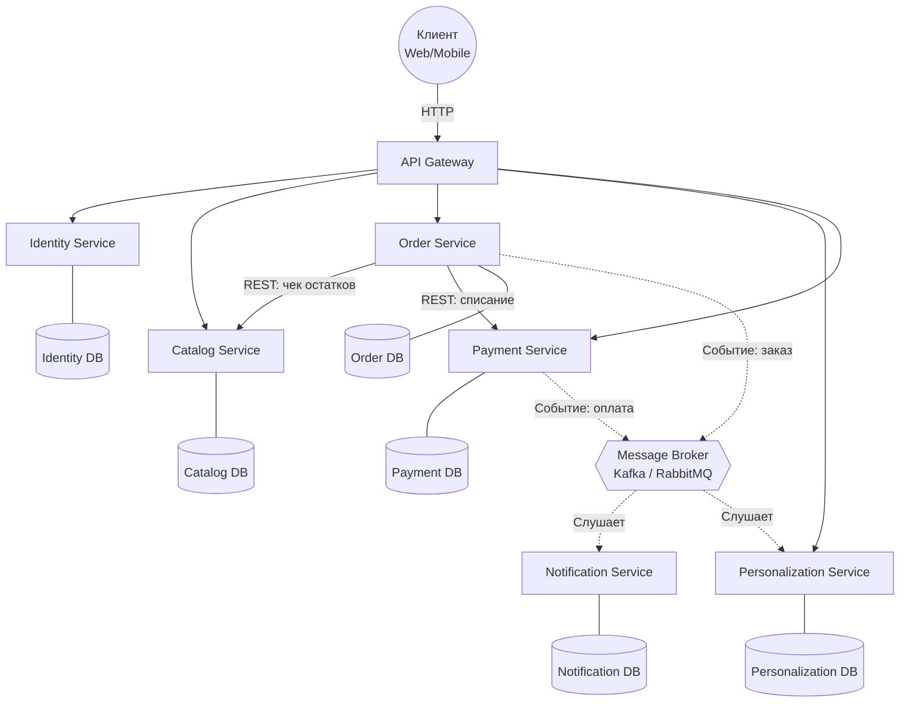

# ДЗ 1. Архитектура маркетплейса

В этом репозитории лежит спроектированная архитектура маркетплейса и один поднятый микросервис (Catalog), запакованный в Docker.

## 1. Выделенные домены и распределение по сервисам
Я решил разбить маркетплейс на несколько ключевых доменов на основе бизнес-процессов. Каждый домен вынесен в отдельный микросервис, чтобы их можно было разрабатывать и масштабировать независимо.

- **API Gateway**: Единая точка входа. Занимается роутингом запросов от клиентов к нужным сервисам и проверяет токены авторизации.
- **Identity Service**: Домен управления пользователями. Отвечает за регистрацию, авторизацию и профили (как селлеров, так и обычных покупателей).
- **Catalog Service**: Домен товаров. Управление карточками товаров, категориями, ценами и проверкой остатков (inventory).
- **Order Service**: Домен заказов. Управление корзиной, процессом оформления заказа и его жизненным циклом (статусами).
- **Payment Service**: Домен оплат. Интеграция с эквайрингом, учет транзакций.
- **Personalization Service**: Домен рекомендаций. Формирует умную ленту товаров под конкретного юзера.
- **Notification Service**: Домен уведомлений. Рассылка писем, пушей и смс.

## 2. Границы владения данными и взаимодействие
Чтобы избежать жесткой связности, я использовал принцип,что общих баз данных нет.
- Identity владеет таблицами юзеров и доступов.
- Catalog владеет товарами и остатками.
- Order владеет составом заказа и ценами на момент покупки.

**Как сервисы общаются между собой:**
- **Синхронно (REST/HTTP):** Используем там, где ответ нужен немедленно для продолжения бизнес-логики. Например, когда юзер жмет "Оформить", `Order Service` делает синхронный запрос в `Catalog Service`, чтобы проверить, не раскупили ли товар, пока он лежал в корзине.
- **Асинхронно (через Message Broker, например RabbitMQ/Kafka):** Применяем для фоновых задач. Когда оплата проходит, `Payment Service` кидает ивент в очередь. `Notification Service` забирает его и шлет письмо с чеком. Если сервис писем ляжет, ивенты просто накопятся в очереди и обработаются позже.

## 3. Схема C4 (Container)

## 4. Альтернативы и Trade-off'ы
Я сравнивал два подхода:

**Вариант 1. Модульный монолит**
Все домены находятся в едином приложении, разделены по пакетам/модулям. База данных физически одна, но логически поделена на схемы.
- *Плюсы:* Проще деплоить, нет сетевых задержек между вызовами доменов.
- *Минусы:* Нельзя отскейлить один конкретный кусок системы. Падение БД или утечка памяти в одном модуле кладет весь маркетплейс целиком. Высокий риск со временем получить сильно связанный код.

**Вариант 2. Микросервисы (Выбранный вариант)**
Каждый домен — это независимое приложение со своей изолированной БД.
- *Плюсы:* Изоляция сбоев (если упадет оплата, пользователи все еще смогут листать каталог). Можно скейлить самые нагруженные части отдельно.
- *Минусы:* Сложности с инфраструктурой, задержки по сети, сложность отката распределенных транзакций.

**Обоснование выбора**
Я выбрал микросервисную архитектуру, так как маркетплейс имеет крайне неравномерный профиль нагрузки. Чтение каталога и запросы к ленте персонализации происходят чаще, чем создание заказов. Важно иметь возможность запустить, условно, 10 подов сервиса каталога и всего 1 под сервиса уведомлений. Кроме того, изоляция сбоев позволяет системе оставаться частично работоспособной при падении некритичных узлов.

## 5 Инструкция
*Перейдите в папку сервиса:*
- cd catalog

*Соберите Docker-образ:*
- docker build -t catalog-service .

*Запустите контейнер:*

- docker run -p 8000:8000 catalog-service

*Проверка*
- curl http://localhost:8000/health-check
- Ответ: {"status": "ok"}